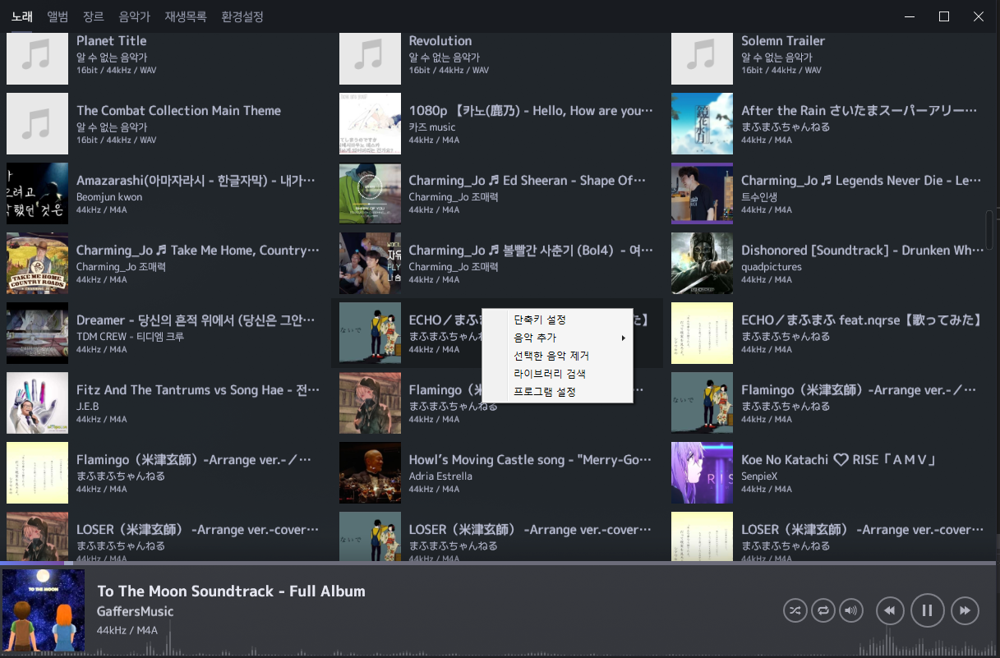
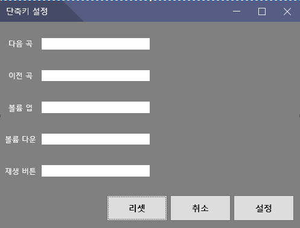
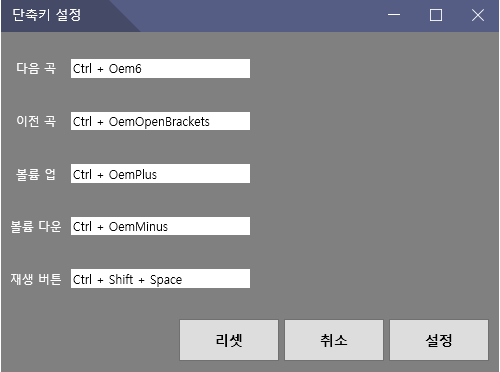

# Presto-Hotkey

## 사용법

 1. Presto 음악 플레이어에서 우클릭을 하여 사진과 같이 뜨게 한다. 

 2. "단축키 설정"을 클릭하셔서 다음과 같은 창을 뜨게 한다. 

 3. 원하시는 단축키를 입력하신 뒤 "설정"을 하시고 자유롭게 사용한다. 

 4. 만약 원하는 키가 재대로 입력이 안됬을 경우 "리셋"을 누르시면 초기화 됩니다, "취소"를 누를시 이전 설정이 그대로 유지됩니다.
